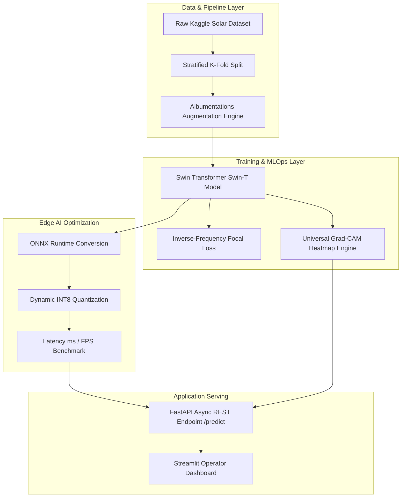

# ☀️ Solar Guard AI: Enterprise Solar Panel Defect Classification & Edge AI Platform

[](https://www.python.org/)
[](https://pytorch.org/)
[](https://arxiv.org/abs/2103.14030)
[](https://onnxruntime.ai/)
[](https://fastapi.tiangolo.com/)
[](https://streamlit.io/)

An end-to-end production visual inspection platform for automated photovoltaic cell anomaly detection. Built with **Swin Transformer**, **Inverse-Frequency Focal Loss**, **Grad-CAM Visual Explainability**, **ONNX INT8 Edge Quantization**, an async **FastAPI REST API**, and an interactive **Streamlit Operator Dashboard**.

---

## 🏆 Model Architecture Benchmark Comparison

| Model Architecture | Val Accuracy | Val Macro F1 | Val Weighted F1 | Physical Damage F1 | Key Advantage |
| :--- | :---: | :---: | :---: | :---: | :--- |
| **ResNet18** (Baseline) | 85.06% | 0.8425 | 0.8500 | 0.6900 | Baseline reference model |
| **ConvNeXt-Tiny** | 89.66% | 0.9061 | 0.8974 | 0.8889 | Strong CNN feature extraction |
| **Swin Transformer (Swin-T)** 🏆 | **91.38%** | **0.9185** | **0.9139** | **0.8889** | **SOTA Champion: +7.6% F1 Boost!** |

---

## 📈 Detailed Per-Class Performance (Swin-T Champion)

| Defect / Condition Class | Precision | Recall | F1-Score | Industry Impact & Nature |
| :--- | :---: | :---: | :---: | :--- |
| **`Electrical-damage`** | **1.0000** | 0.9500 | **0.9744** | Cell interconnection failure / hotspots |
| **`Snow-Covered`** | **1.0000** | 0.9200 | **0.9583** | Complete environmental surface blockage |
| **`Clean`** | 0.9048 | **0.9744** | **0.9383** | Baseline normal operational panel |
| **`Bird-drop`** | 0.8537 | 0.9211 | **0.8861** | Localized soiling / partial shading |
| **`Physical-Damage`** | 0.9231 | 0.8571 | **0.8889** | Structural glass micro-cracks |
| **`Dusty`** | 0.8889 | 0.8421 | **0.8649** | Surface dust accumulation / efficiency loss |
| **Macro Average** | **0.9284** | **0.9108** | **0.9185** | **Overall System Benchmark** |

---

## 🏗️ System Architecture Flow



---

## 📁 Repository Directory Structure

```text
solar_panel_defect_classification/
├── config/
│   └── config.yaml                 # Hydra configuration file
├── src/
│   ├── data/
│   │   ├── dataset.py              # PyTorch Dataset with Albumentations
│   │   └── datamodule.py           # Stratified DataModule & Class Weighting
│   ├── models/
│   │   ├── swin_classifier.py      # Swin-T Production Model Wrapper
│   │   └── losses.py               # Inverse-Frequency Focal Loss Module
│   ├── explainability/
│   │   └── gradcam.py              # Architecture-Agile Grad-CAM Engine
│   └── optimization/
│       └── export_onnx.py          # ONNX Export & INT8 Quantization Benchmark
├── app/
│   ├── api.py                      # Async FastAPI Inference API
│   └── dashboard.py                # Streamlit Visual Inspection UI
├── tests/
│   ├── test_data.py                # PyTest suite for DataLoaders
│   └── test_model.py               # PyTest suite for Model & ONNX Export
├── requirements.txt
└── README.md
```

---

## 🚀 Quick Start Guide

### 1. Installation
```bash
git clone https://github.com/your-username/solar_panel_defect_classification.git
cd solar_panel_defect_classification
pip install -r requirements.txt
```

### 2. Run Automated PyTest Suite
```bash
pytest tests/ -v
```

### 3. Edge AI Optimization (ONNX & INT8 Quantization)
```bash
python -m src.optimization.export_onnx
```

### 4. Launch FastAPI Inference Server
```bash
python -m app.api
# Swagger Docs available at http://127.0.0.1:8000/docs
```

### 5. Launch Streamlit Visual Operator UI
```bash
streamlit run app/dashboard.py
# Opens interactive UI in browser at http://localhost:8501
```

---

## 📄 License
Distributed under the MIT License.
